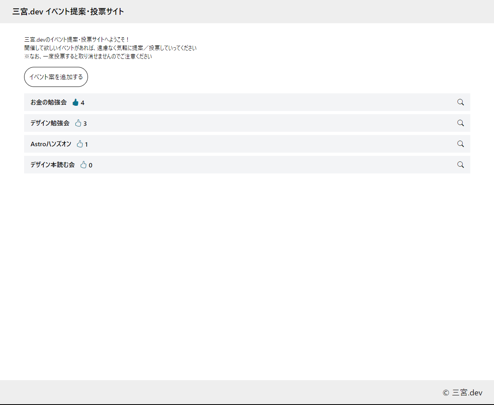

<p style="text-align: center">
  
</p>

---

# イベント提案・投票サイト（Event Proposal）

[イベント提案・投票サイト](https://proposal.sannomiya.dev/)は、三宮.devで開催してほしい勉強会やイベントを誰でも提案・投票できるサイトです

オープンソースとして管理されているので、誰でもプロジェクトに貢献できます  
本プロジェクトへのコントリビュートは [コントリビュート](#コントリビュート) を参照してください



# ドキュメント

本プロジェクトの仕様や設計については [Wiki](https://github.com/tessai9/event-proposal/wiki)を参照ください

# 開発の始め方

1. プロジェクトをfork
1. リポジトリをclone
    ```
    $ git clone git@github.com:<username>/event-proposal.git
    ```
1. ディレクトリに移動
    ```
    $ cd event-proposal
    ```
1. パッケージをinstall
    ```
    $ npm install
    ```
1. アプリを実行
    ```
    $ npm run dev
    ```

なお、supabaseへ接続するには`.env`に環境変数の設定が必要です
- `PUBLIC_SUPABASE_PROJECT_URL`
- `PUBLIC_SUPABASE_PUBLIC_KEY`

# コントリビュート

## Issue

不具合の報告や機能改善の提案など気軽に作成してください  
issue内で方針を議論していきましょう

## Pull Request

不具合の修正や機能追加、ドキュメントの修正などを行ったらPull Requestを作成してください  

Pull Requestの作り方
1. [開発の始め方](#開発の始め方) に沿って環境構築
1. 修正を加えたbranchを作成し、Forkしたリポジトリにpush
1. githubからPull Requestを作成
